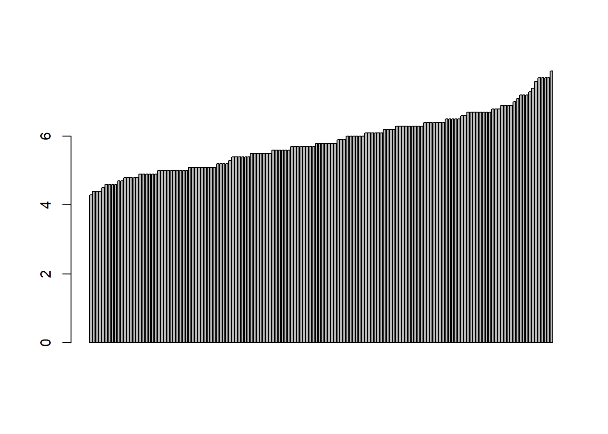
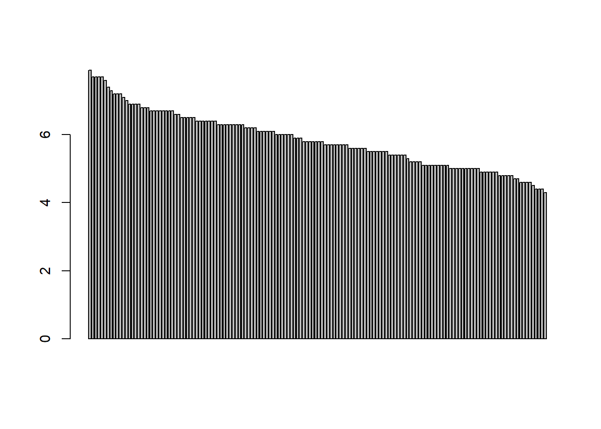

## Manipuler les données
Ce chapitre recouvre les principales commandes pour manipuler les données. Nous y retrouvons les fonctions principales comme afficher, trier, sélectionner ou filtrer. Le jeu de données est "iris", qui est un des jeux de données proposé nativement par le logiciel R.

### Obtenir le nom des différentes variables avec names()
Pour de nombreuses raisons, il est utile de visualiser rapidement le nom des différentes variables constituant le jeu de données.


```r
names(iris)
```

```
## [1] "Sepal.Length" "Sepal.Width"  "Petal.Length" "Petal.Width"  "Species"
```

<br>
<hr>
<br>

### Afficher les données avec la fonction head()
La fonction head() est très pratique pour visualiser rapidement le jeu de données et ses libellés. Par défaut, la fonction head() affiche 6 premières lignes dont les libellés. Il est possible de rajouter le nombre de lignes souhaitées.


```r
# dataset = iris

# Fonction head()
head(iris)
```

```
##   Sepal.Length Sepal.Width Petal.Length Petal.Width Species
## 1          5.1         3.5          1.4         0.2  setosa
## 2          4.9         3.0          1.4         0.2  setosa
## 3          4.7         3.2          1.3         0.2  setosa
## 4          4.6         3.1          1.5         0.2  setosa
## 5          5.0         3.6          1.4         0.2  setosa
## 6          5.4         3.9          1.7         0.4  setosa
```

```r
# Fonction head() + rajout du nombre de lignes
head(iris, 15)
```

```
##    Sepal.Length Sepal.Width Petal.Length Petal.Width Species
## 1           5.1         3.5          1.4         0.2  setosa
## 2           4.9         3.0          1.4         0.2  setosa
## 3           4.7         3.2          1.3         0.2  setosa
## 4           4.6         3.1          1.5         0.2  setosa
## 5           5.0         3.6          1.4         0.2  setosa
## 6           5.4         3.9          1.7         0.4  setosa
## 7           4.6         3.4          1.4         0.3  setosa
## 8           5.0         3.4          1.5         0.2  setosa
## 9           4.4         2.9          1.4         0.2  setosa
## 10          4.9         3.1          1.5         0.1  setosa
## 11          5.4         3.7          1.5         0.2  setosa
## 12          4.8         3.4          1.6         0.2  setosa
## 13          4.8         3.0          1.4         0.1  setosa
## 14          4.3         3.0          1.1         0.1  setosa
## 15          5.8         4.0          1.2         0.2  setosa
```

<br>
<hr>
<br>

### Fonction summary()
A noter que nous pouvons avoir une vision complète du jeu de données avec la fonction summary() qui propose également quelques statistiques descriptives.


```r
summary(iris)
```

```
##   Sepal.Length    Sepal.Width     Petal.Length    Petal.Width   
##  Min.   :4.300   Min.   :2.000   Min.   :1.000   Min.   :0.100  
##  1st Qu.:5.100   1st Qu.:2.800   1st Qu.:1.600   1st Qu.:0.300  
##  Median :5.800   Median :3.000   Median :4.350   Median :1.300  
##  Mean   :5.843   Mean   :3.057   Mean   :3.758   Mean   :1.199  
##  3rd Qu.:6.400   3rd Qu.:3.300   3rd Qu.:5.100   3rd Qu.:1.800  
##  Max.   :7.900   Max.   :4.400   Max.   :6.900   Max.   :2.500  
##        Species  
##  setosa    :50  
##  versicolor:50  
##  virginica :50  
##                 
##                 
## 
```
<br>
<hr>
<br>

### Sélectionner une variable avec $()
Le symbole $ permet de sélectionner une variable du jeu de données. Par exemple, nous souhaitons afficher la variable "Sepal.Length" du jeu de données iris


```r
# Fonction $() et fonction head()
head(iris$Sepal.Length, 20)
```

```
##  [1] 5.1 4.9 4.7 4.6 5.0 5.4 4.6 5.0 4.4 4.9 5.4 4.8 4.8 4.3 5.8 5.7 5.4 5.1 5.7
## [20] 5.1
```

<br>
<hr>
<br>

### Sélection et affichage d'unités statistiques 
Découvrons maintenant les principales fonctions permettant d'afficher certaines unités statistiques du jeu de données.


```r
# Sélection d'une unité statistique (ligne 5)
iris[5,] 
```

```
##   Sepal.Length Sepal.Width Petal.Length Petal.Width Species
## 5            5         3.6          1.4         0.2  setosa
```

```r
# Sélection de plusieurs groupe d'unités statistiques (exemple : ligne de 5 à 10)
iris[5:10,]
```

```
##    Sepal.Length Sepal.Width Petal.Length Petal.Width Species
## 5           5.0         3.6          1.4         0.2  setosa
## 6           5.4         3.9          1.7         0.4  setosa
## 7           4.6         3.4          1.4         0.3  setosa
## 8           5.0         3.4          1.5         0.2  setosa
## 9           4.4         2.9          1.4         0.2  setosa
## 10          4.9         3.1          1.5         0.1  setosa
```

```r
# Sélection de plusieurs unités statistiques 
iris[c(5, 15, 20, 33, 45),]
```

```
##    Sepal.Length Sepal.Width Petal.Length Petal.Width Species
## 5           5.0         3.6          1.4         0.2  setosa
## 15          5.8         4.0          1.2         0.2  setosa
## 20          5.1         3.8          1.5         0.3  setosa
## 33          5.2         4.1          1.5         0.1  setosa
## 45          5.1         3.8          1.9         0.4  setosa
```


<br>
<hr>
<br>

### Trier et extraire les variables avec la fonction subset()
La commande subset() permet d'extraire les données d'un tableau selon ses conditions. Elle permet de trier les variables en fonction de plusieurs critères. Dans le second exemple, nous souhaitons les unités statistiques comprenant les longueurs de pétales supérieures à 7.2 mm, de l'espèce 'Seposa'


```r
# Fonction subset()
subset(iris, iris$Sepal.Length > 7.2)
```

```
##     Sepal.Length Sepal.Width Petal.Length Petal.Width   Species
## 106          7.6         3.0          6.6         2.1 virginica
## 108          7.3         2.9          6.3         1.8 virginica
## 118          7.7         3.8          6.7         2.2 virginica
## 119          7.7         2.6          6.9         2.3 virginica
## 123          7.7         2.8          6.7         2.0 virginica
## 131          7.4         2.8          6.1         1.9 virginica
## 132          7.9         3.8          6.4         2.0 virginica
## 136          7.7         3.0          6.1         2.3 virginica
```

```r
# Autres exemples avec subset()
subset(iris, iris$Sepal.Length > 7.2, Species = "seposa")
```

```
##     Sepal.Length Sepal.Width Petal.Length Petal.Width   Species
## 106          7.6         3.0          6.6         2.1 virginica
## 108          7.3         2.9          6.3         1.8 virginica
## 118          7.7         3.8          6.7         2.2 virginica
## 119          7.7         2.6          6.9         2.3 virginica
## 123          7.7         2.8          6.7         2.0 virginica
## 131          7.4         2.8          6.1         1.9 virginica
## 132          7.9         3.8          6.4         2.0 virginica
## 136          7.7         3.0          6.1         2.3 virginica
```

<br>
<hr>
<br>

### Trier avec la fonction sort() 
#### Ordre croissant et décroissant


```r
# Fonction sort()
sort(iris$Sepal.Length)
```

```
##   [1] 4.3 4.4 4.4 4.4 4.5 4.6 4.6 4.6 4.6 4.7 4.7 4.8 4.8 4.8 4.8 4.8 4.9 4.9
##  [19] 4.9 4.9 4.9 4.9 5.0 5.0 5.0 5.0 5.0 5.0 5.0 5.0 5.0 5.0 5.1 5.1 5.1 5.1
##  [37] 5.1 5.1 5.1 5.1 5.1 5.2 5.2 5.2 5.2 5.3 5.4 5.4 5.4 5.4 5.4 5.4 5.5 5.5
##  [55] 5.5 5.5 5.5 5.5 5.5 5.6 5.6 5.6 5.6 5.6 5.6 5.7 5.7 5.7 5.7 5.7 5.7 5.7
##  [73] 5.7 5.8 5.8 5.8 5.8 5.8 5.8 5.8 5.9 5.9 5.9 6.0 6.0 6.0 6.0 6.0 6.0 6.1
##  [91] 6.1 6.1 6.1 6.1 6.1 6.2 6.2 6.2 6.2 6.3 6.3 6.3 6.3 6.3 6.3 6.3 6.3 6.3
## [109] 6.4 6.4 6.4 6.4 6.4 6.4 6.4 6.5 6.5 6.5 6.5 6.5 6.6 6.6 6.7 6.7 6.7 6.7
## [127] 6.7 6.7 6.7 6.7 6.8 6.8 6.8 6.9 6.9 6.9 6.9 7.0 7.1 7.2 7.2 7.2 7.3 7.4
## [145] 7.6 7.7 7.7 7.7 7.7 7.9
```

```r
# Affichage barplot()
c <- sort(iris$Sepal.Length)
barplot(c)
```



```r
# Fonction sort() décroissante
sort(iris$Sepal.Length, decreasing = T)
```

```
##   [1] 7.9 7.7 7.7 7.7 7.7 7.6 7.4 7.3 7.2 7.2 7.2 7.1 7.0 6.9 6.9 6.9 6.9 6.8
##  [19] 6.8 6.8 6.7 6.7 6.7 6.7 6.7 6.7 6.7 6.7 6.6 6.6 6.5 6.5 6.5 6.5 6.5 6.4
##  [37] 6.4 6.4 6.4 6.4 6.4 6.4 6.3 6.3 6.3 6.3 6.3 6.3 6.3 6.3 6.3 6.2 6.2 6.2
##  [55] 6.2 6.1 6.1 6.1 6.1 6.1 6.1 6.0 6.0 6.0 6.0 6.0 6.0 5.9 5.9 5.9 5.8 5.8
##  [73] 5.8 5.8 5.8 5.8 5.8 5.7 5.7 5.7 5.7 5.7 5.7 5.7 5.7 5.6 5.6 5.6 5.6 5.6
##  [91] 5.6 5.5 5.5 5.5 5.5 5.5 5.5 5.5 5.4 5.4 5.4 5.4 5.4 5.4 5.3 5.2 5.2 5.2
## [109] 5.2 5.1 5.1 5.1 5.1 5.1 5.1 5.1 5.1 5.1 5.0 5.0 5.0 5.0 5.0 5.0 5.0 5.0
## [127] 5.0 5.0 4.9 4.9 4.9 4.9 4.9 4.9 4.8 4.8 4.8 4.8 4.8 4.7 4.7 4.6 4.6 4.6
## [145] 4.6 4.5 4.4 4.4 4.4 4.3
```

```r
d <- sort(iris$Sepal.Length, decreasing = T)

# Affichage barplot()
barplot(d)
```



<br>
<hr>
<br>


